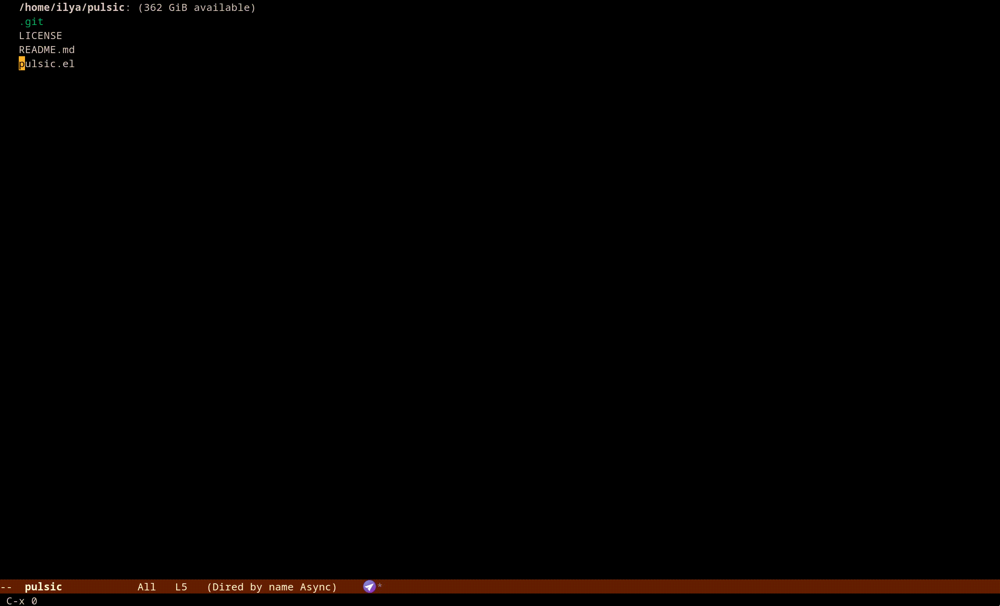

# `pulsic`

The package provides a global minor mode that temporarily highlights the
current line on every window state change (see `window-state-change-hook`),
except when the last command called is listed in `pulsic-predicate`.

Similar package: pulsar.el, hl-line+.el, beacon.el

TOC

- [Installation](#installation)
- [Screenshots and configuration examples](#screenshots-and-configuration-examples)

## Installation

``` elisp
(use-package pulsic
  :init
  (unless (package-installed-p 'pulsic)
    (package-vc-install
     '(pulsic :vc-backend Git
              :url "https://github.com/ichernyshovvv/pulsic.el")))
  :config
  (pulsic-mode 1)
  :custom
  (pulsic-duration 0.5)
  (pulsic-predicate
   (lambda ()
     (not
      (or (memq last-command
                '( chloe-clock-in-dwim chloe-clock-in
                   indent-for-tab-command))
          (derived-mode-p 'telega-chat-mode 'enlight-mode)
          (minibufferp))))))
```

## Demo


